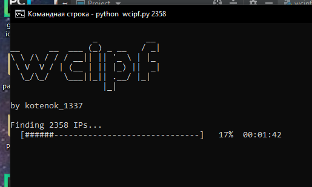

# wcipf - Webcam IP Finder
This script can find more than 2000 opened webcam IPs!

## Initialization
First, you need to install Python.
For Termux:
```
pkg install python
```

Then, install Python modules using pip.
```
pip install requests typer art blessed
```

Finnaly, run it!
```
python wcipf.py <amount>
```

Example: ```python wcipf.py 200```
